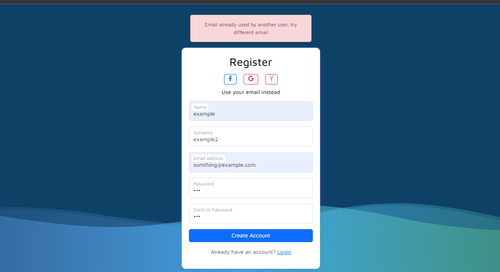

# Registration & Login System

## Project Description

A Springboot Application that includes a login and registration system,
Users can create an account by registering with a unique email. The application verifies the entered
credentials during the login process and grants access to personalized features upon successful authentication.

## Front-End Technologies

<ul>
<li>HTML</li>
<li>CSS</li>
<li>Bootstrap CSS</li>
</ul>

## Back-End Languages

<ul>
<li>Java</li>
<li>JavaScript</li>
</ul>

## Dependencies

<ul>
<li>Spring Data JPA</li>
<li>Spring Security</li>
<li>Spring Boot Dev Tools</li>
<li>H2 Database</li>
<li>Validation</li>
<li>Lombok</li>
<li>Thymeleaf</li>
</ul>

# How to use?

After cloning the repository, you can follow the following instructions to use the project;

## Registration

1 - Run the Springboot Application and move to ```localhost:8080/register```
you will face the registration form


2 - Fill your information and press "Create Account", if there is no issues the form
will redirect you automatically to the login form, where you can check and validate
your information


Access to the H2DB by heading up to ```localhost:8080/h2-console``` and press connect,
below is an image describes the "users" table in the database after a successful registration.


3 - Validate your information at the login form:

### Successful Login Attempt


<hr>

### Incorrect information or Bad Credentials


### Registration Exceptions

1 - You can't create an account with an email used already,
the form will reject the request and popout an error



2 - When the form validates itself before sending;
it checks for empty input fields, wrong email patterns and gives a hint of the error below the invalid input field


## Login

Login form is available at ```localhost:8080/login```, head to this address and try
to validate your information after you created an account in the registration form.


<hr>

### Empty try to log in, rejected by the form


### Successful Login Attempt


<hr>

### Incorrect information or Bad Credentials


## Get all database records

Access all database records in a tabular form,
go to ``localhost:8080/get-all-users`` and you will see the database records
in the html page.


## Notes

1 - Since we are using an in-memory database (H2DB), the database will wipe all the data entered previously and recreate
itself, however you can use a different database that suits your needs.

2 - The [data.sql](src/main/resources/data.sql) file contains preloaded data for test purposes,
you can't use the credentials from the file trying to log in, because the project uses password encryption and stores
the passwords in an encrypted form in the database.


